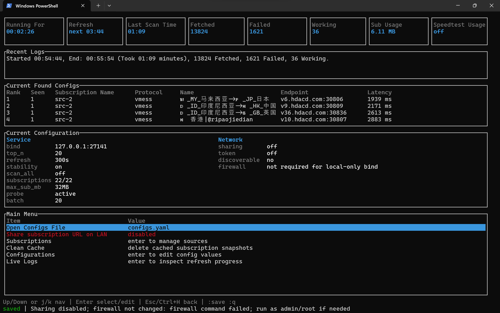

<p align="center">
  <a href="https://deepwiki.com/411A/V2RayDAR">
    
  </a>
</p>

<p align="center">
  
</p>

<h1 align="center">V2RayDAR</h1>

<p align="center">
  <em>V2Ray Detection And Reconnaissance — pronounced like <code>v2ray</code> + <code>radar</code>.</em>
</p>

<p align="center">
  A fast Rust CLI/TUI that fetches V2Ray subscription sources, validates them through your real network with <code>sing-box</code>, ranks the configs that actually work, and re-publishes the best ones at a local subscription URL your v2rayN / v2rayNG / sing-box client can point to.
</p>

<p align="center">
  📘 <a href="README_detailed.md">Read the detailed developer guide</a>
</p>


## Copy-paste setup (latest V2RayDAR + bundled sing-box)

Copy the block for your OS into a terminal. Desktop scripts download the latest `_with_singbox` archive into `Desktop/V2RayDAR` when a Desktop folder exists, otherwise `~/V2RayDAR`, extract it, and start V2RayDAR from that folder. The bundled `sing-box` is auto-detected, so `probe.sing_box_path` can stay `null`.

<details>
<summary>🪟 Windows PowerShell</summary>

```powershell
$ErrorActionPreference = 'Stop'
if (-not [Environment]::Is64BitOperatingSystem) { throw 'The bundled Windows release is x86_64; 32-bit Windows is not supported.' }

$asset = 'v2raydar-windows-x86_64_with_singbox.zip'
$url = "https://github.com/411A/V2RayDAR/releases/latest/download/$asset"
$homeDir = if ($HOME) { $HOME } elseif ($env:USERPROFILE) { $env:USERPROFILE } else { throw 'Cannot find your home folder.' }
$desktop = [Environment]::GetFolderPath([Environment+SpecialFolder]::DesktopDirectory)
if ([string]::IsNullOrWhiteSpace($desktop)) { $desktop = Join-Path $homeDir 'Desktop' }
$root = Join-Path $(if (Test-Path $desktop) { $desktop } else { $homeDir }) 'V2RayDAR'
$archive = Join-Path $root $asset

Write-Host "📁 Preparing $root"
New-Item -ItemType Directory -Force $root | Out-Null
Write-Host '⬇️ Downloading V2RayDAR with bundled sing-box'
Invoke-WebRequest -Headers @{ 'User-Agent' = 'V2RayDAR-setup' } -Uri $url -OutFile $archive
Write-Host '📦 Extracting archive'
Expand-Archive -LiteralPath $archive -DestinationPath $root -Force

$run = Join-Path $root 'v2raydar.exe'
if (!(Test-Path $run)) { throw "Could not find $run after extraction." }
Write-Host "✅ Ready in $root"
Write-Host '🚀 Starting V2RayDAR'
Set-Location $root
& .\v2raydar.exe --portable
```

</details>

<details>
<summary>💻 Linux</summary>

```bash
set -euo pipefail
case "$(uname -m)" in x86_64|amd64) ;; *) echo "❌ The bundled Linux release is x86_64; found $(uname -m)." >&2; exit 1 ;; esac

asset="v2raydar-linux-x86_64_with_singbox.tar.gz"
url="https://github.com/411A/V2RayDAR/releases/latest/download/$asset"
base="$HOME"; [ -d "$HOME/Desktop" ] && base="$HOME/Desktop"
root="$base/V2RayDAR"; archive="$root/$asset"

mkdir -p "$root"
echo "📁 Preparing $root"
echo "⬇️ Downloading V2RayDAR with bundled sing-box"
if command -v curl >/dev/null 2>&1; then curl -fL "$url" -o "$archive"; elif command -v wget >/dev/null 2>&1; then wget -O "$archive" "$url"; else echo "❌ Install curl or wget first." >&2; exit 1; fi
echo "📦 Extracting archive"
tar -xzf "$archive" -C "$root"
chmod +x "$root/v2raydar" "$root/sing-box"

echo "✅ Ready in $root"
echo "🚀 Starting V2RayDAR"
cd "$root"
./v2raydar --portable
```

</details>

<details>
<summary>🍎 macOS</summary>

```bash
set -euo pipefail
asset="v2raydar-macos-universal_with_singbox.zip"
url="https://github.com/411A/V2RayDAR/releases/latest/download/$asset"
base="$HOME"; [ -d "$HOME/Desktop" ] && base="$HOME/Desktop"
root="$base/V2RayDAR"; archive="$root/$asset"

mkdir -p "$root"
echo "📁 Preparing $root"
echo "⬇️ Downloading V2RayDAR with bundled sing-box"
curl -fL "$url" -o "$archive"
echo "📦 Extracting archive"
ditto -x -k "$archive" "$root"
chmod +x "$root/V2RayDAR.app/Contents/MacOS/"{V2RayDAR,v2raydar-bin,sing-box}

echo "✅ Ready in $root"
echo "🚀 Starting V2RayDAR"
cd "$root"
"$root/V2RayDAR.app/Contents/MacOS/V2RayDAR" --portable
```

</details>

<details>
<summary>📱 Android / Termux</summary>

Termux uses the Termux release archive and the Termux `sing-box` package instead of a desktop `_with_singbox` archive.

```bash
echo "📦 Updating Termux packages"
pkg update -y || true
echo "🧰 Installing curl, tar, and sing-box"
pkg install -y curl tar sing-box=1.13.13 || pkg install -y curl tar

case "$(uname -m)" in
  aarch64|arm64) asset="v2raydar-termux-aarch64.tar.gz" ;;
  x86_64|amd64) asset="v2raydar-termux-x86_64.tar.gz" ;;
  *) echo "❌ Unsupported Termux architecture: $(uname -m)" >&2; exit 1 ;;
esac

root="$HOME/V2RayDAR"
mkdir -p "$root"
cd "$root"
echo "⬇️ Downloading $asset"
curl -fL "https://github.com/411A/V2RayDAR/releases/latest/download/$asset" -o "$asset" || { echo "❌ Download failed" >&2; exit 1; }
echo "📦 Extracting archive"
tar -xzf "$asset"
cd "${asset%.tar.gz}"
echo "🧩 Installing V2RayDAR command"
./install-termux.sh || { echo "❌ Install failed" >&2; exit 1; }
echo "🚀 Starting V2RayDAR (Ctrl+C to stop)"
v2raydar --no-tui
```

</details>

Desktop scripts leave the downloaded archive and extracted app in the chosen `V2RayDAR` folder, then run with `--portable` so config and cache stay beside the executable. Termux installs the `v2raydar` command and uses the Termux-managed `sing-box` path.

---

## Why V2RayDAR

- Pulls subscriptions in parallel from any number of sources you list.
- Parses raw, base64, JSON, and YAML feeds — and `vmess`, `vless`, `trojan`, `ss`, `ssr`, `hysteria2`, `hy2`, `tuic` share-links.
- Validates each candidate through your current network with `sing-box` (it actually loads a test URL through the proxy).
- Re-exposes the top working configs at a local URL so any compatible client just sees one always-fresh subscription.
- Survives restricted networks via a snapshot cache, an in-network bridge config, or an `emergency_config`.
- Optional LAN sharing with optional token protection, so the phone in your pocket can use the same feed.

> [!WARNING]
> ### 🚧 Alpha Release
>
> This software is currently in **Alpha**.
>
> - Breaking changes may occur at any time.
> - Documentation may be incomplete.
> - Bugs and instability are expected.
> - Not recommended for production environments.
>
> Please report issues and feedback.

🖥️ Windows TUI Preview:

<p align="center">
  
</p>

## Quick start

1. **Get sing-box**. Active probing needs a working `sing-box` executable. Use a desktop `_with_singbox` release archive to get pinned `sing-box` 1.13.13 bundled beside V2RayDAR, or install it yourself. Termux users should install `sing-box=1.13.13` with `pkg`.
2. **Run V2RayDAR**. Use the copy-paste setup above, a release binary for your OS, or build from source with `cargo run --release`.
3. **First launch** creates `configs.yaml`; the copy-paste desktop setup keeps it in the downloaded `V2RayDAR` folder, while normal installed mode uses the platform app-data folder. If no bundled, Termux-package, or configured `sing-box` executable is found while `probe.mode: active`, the TUI asks for the full path.
4. **Point your client** at one of the local URLs below.

### Local URLs (default `127.0.0.1:27141`)

| Endpoint | Use for |
| --- | --- |
| `http://127.0.0.1:27141/subscription` | base64 subscription feed — what v2rayN / v2rayNG expect |
| `http://127.0.0.1:27141/subscription.txt` | the same, but plain newline-separated share-links |
| `http://127.0.0.1:27141/results` | JSON diagnostics for the last refresh |
| `http://127.0.0.1:27141/health` | reachability check — returns `ok` |

### Run modes

```bash
# normal — TUI + local subscription endpoint
v2raydar

# headless — no TUI, just the endpoint and logs
v2raydar --no-tui

# one-shot — refresh once, print results, then exit
v2raydar --once

# use a custom config file
v2raydar --config path/to/configs.yaml

# keep all data next to the executable
v2raydar --portable

# remove app data and owned firewall rules
v2raydar --uninstall
```

Windows users replace `v2raydar` with `v2raydar.exe`. On macOS open the bundled `.app` once and Gatekeeper will remember it.

## Default config at a glance

<details>
  <summary>👣 <strong>configs.yaml</strong> — table of every key, default, and what it does. Full explanations live in the <a href="README_detailed.md">detailed guide</a>.</summary>

| Key | Default | Purpose |
| --- | --- | --- |
| `bind` | `127.0.0.1:27141` | Local HTTP bind address for `/subscription`, `/subscription.txt`, `/results`, and `/health`. |
| `top_n` | `10` | Number of working configs published to clients. |
| `refresh_seconds` | `300` | Auto-refresh interval in seconds; `0` disables the timer. |
| `encoded_subscription` | `true` | Returns `/subscription` as base64 (v2rayN / v2rayNG friendly). |
| `prioritize_stability` | `true` | Re-pings the previous run's saved top-N first and keeps them at the front, even if new low-ping configs appear. When `false`, prefers any working low-ping config. |
| `return_configs_asap` | `false` | When `true`, publishes working configs to the endpoint and `Current Found Configs` as soon as they are found, up to `top_n`; early configs may not have the lowest ping or best stability. |
| `scan_all_configs` | `false` | When `true`, validates every loaded config instead of stopping after enough have been confirmed. |
| `fetch_timeout_ms` | `30000` | Per-source fetch timeout. |
| `fetch_concurrency` | `8` | Subscription sources fetched in parallel. |
| `max_subscription_bytes` | `33554432` | Size cap per fetched subscription source (32 MiB). |
| `use_cache_only` | `false` | When `true`, skip fresh fetches and test only cached HTTP snapshots — useful on heavily restricted networks. |
| `emergency_config` | `null` | Optional working share-link used through `sing-box` as a bridge when HTTP subscription fetches fail. |
| `sharing.enabled` | `false` | Lets LAN clients read the endpoints. |
| `sharing.require_token` | `false` | Requires `?token=...` for LAN requests. |
| `sharing.token` | `null` | Leave empty, set `true` to auto-generate, or supply a string. |
| `probe.mode` | `active` | `active` uses `sing-box`; `tcp` is diagnostic only. |
| `probe.sing_box_path` | `null` | Optional path to `sing-box`. Leave `null` for desktop `_with_singbox` builds or Termux's package path. |
| `probe.connect_timeout_ms` | `5000` | TCP connect timeout for diagnostic probing. |
| `probe.active_timeout_ms` | `30000` | HTTP test timeout in active mode. |
| `probe.startup_timeout_ms` | `5000` | Wait time for the temporary proxy to come up. |
| `probe.concurrency` | `16` | Base active-probing concurrency. |
| `probe.batch_size` | `20` | Initial active-probing batch size. |
| `probe.process_concurrency` | `null` | `sing-box` batch processes allowed at once; auto-scales when empty. |
| `probe.test_url` | `https://www.gstatic.com/generate_204` | URL loaded through each candidate. |
| `probe.accepted_statuses` | `[204, 200]` | HTTP statuses counted as success. |
| `probe.download_url` | `null` | Optional throughput-test target. |
| `probe.download_bytes_limit` | `1048576` | Upper bound for the optional download test. |
| `subscriptions` | _(two demo entries)_ | List of `{ name, url, enabled, priority }` sources. |

</details>

## Notes for restricted networks

- If you are on a very restricted network, it is recommended to never delete the cache so the app can test cached HTTP subscription snapshots.
- By default, if some HTTP subscription URLs don't connect on your network but one config is reachable, the app uses that config to retry those failed HTTP subscriptions too. And if there are no working configs on your network but you have one working config yourself, you can bring it into `configs.yaml`'s `emergency_config` so the app uses it to retry failed HTTP subscription fetches.

## Pointing common clients at V2RayDAR

- **v2rayN (same PC)** — keep `bind: 127.0.0.1:27141` and add `http://127.0.0.1:27141/subscription` as a subscription URL.
- **v2rayNG / phone on the same Wi-Fi** — bind to the PC's LAN IP (e.g. `192.168.1.23:27141`), turn on `sharing.enabled`, then use `http://192.168.1.23:27141/subscription` on the phone. Visit `/health` from the phone first to confirm reachability.

Full client walkthroughs, token-protected sharing, and OS-specific firewall details are in the [detailed guide](README_detailed.md).

## Contributing

PRs are welcome.

## Roadmap

- Add a cross-platform GUI app beside the TUI using Tauri.
- Extract V2Ray configs from the body of any website — preferably from non-JS-heavy sites, with Obscura as a fallback for the JS-heavy ones.
- Private endpoints with password requirements and authentication: when a subscription endpoint is private and password-protected, users can get their private endpoint that fetches the configs through a national reachable endpoint that has internet access.

## Warranty and responsibility

The app is published as-is, without any warranty.

The developer will not, by itself, create or distribute V2Ray-compatible configs, and is not responsible for the V2Ray subscriptions the user scans and connects to. The owner of the V2Ray server you connect to may be able to intercept your traffic and read your unencrypted data.
