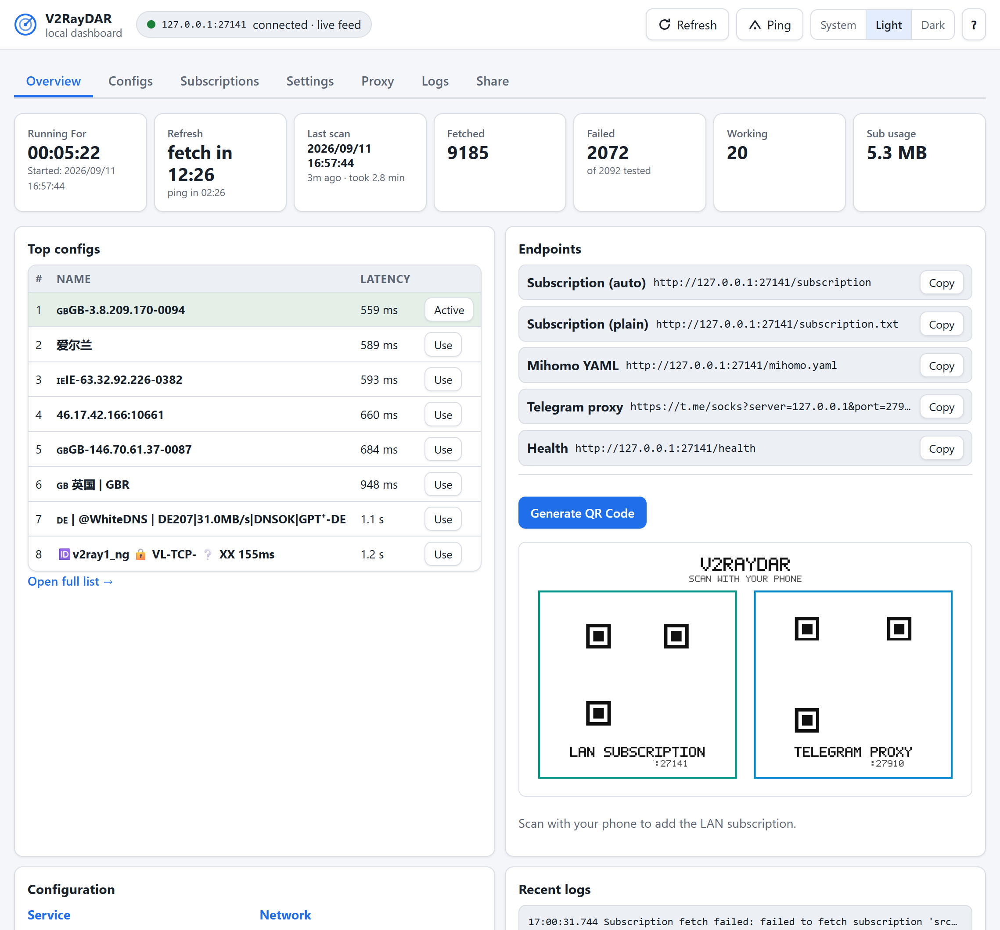
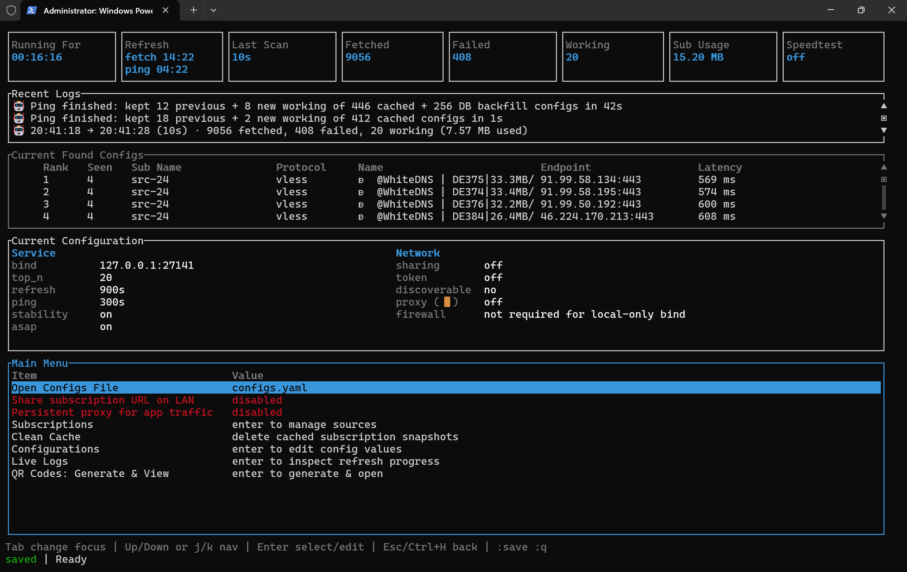

<p align="center">
  <a href="https://deepwiki.com/411A/V2RayDAR">
    
  </a>
</p>

<p align="center">
  <strong>🌐 Available in</strong><br>
  <strong><a href="../README.md">English</a></strong>
  • <strong><a href="README.fa.md">فارسی</a></strong>
  • <strong><a href="README.zh-CN.md">简体中文</a></strong>
  • <strong><a href="README.ru.md">Русский</a></strong>
  • <strong><a href="README.fr.md">Français</a></strong>
</p>

<p align="center">
  
</p>

<h1 align="center">V2RayDAR</h1>

<p align="center">
  <em>Détection et Reconnaissance V2Ray — se prononce comme <code>v2ray</code> + <code>radar</code>.</em><br>
  
</p>

<p align="center">
  <strong>Lancez-le une fois sur n'importe quel appareil toujours allumé — vieux téléphone, PC, Raspberry Pi ou serveur domestique — et V2RayDAR trouve, vérifie et sert en continu les meilleures configs fonctionnelles à tous les appareils de votre LAN. Il expose aussi un proxy standard SOCKS5/HTTP, donc chaque appareil de votre LAN profite d'une connexion V2Ray fonctionnelle — sans client V2Ray.</strong>
</p>

<p align="center">
  Un service rapide en Rust avec tableau de bord web intégré qui récupère les sources d'abonnement V2Ray / Clash / Mihomo, les valide via votre réseau réel avec <code>sing-box</code>, classe les configurations qui fonctionnent vraiment et les republie sur une URL d'abonnement locale pour vos clients v2rayN / v2rayNG / sing-box / Clash Verge / Mihomo. Une interface terminal optionnelle (<code>--tui</code>) couvre quelques actions de maintenance supplémentaires.
</p>

<p align="center">
  📘 <a href="guide.md">Lire le guide développeur détaillé</a>
</p>

## 🌐 Tableau de bord web (par défaut)

Après avoir démarré l'application, ouvrez http://127.0.0.1:27141 dans votre navigateur. Le tableau de bord couvre l'usage quotidien de bout en bout : statistiques en direct dans Overview, configs classées dans Configs avec QR codes par ligne, gestion des abonnements dans Subscriptions (ajout, modification, activation/désactivation, suppression, réorganisation par glisser-déposer), tous les réglages dans l'onglet Settings, l'onglet Proxy, le partage LAN, les logs en direct et une feuille de QR codes pour connecter les téléphones.

<p align="center">
  
</p>

## 🖥️ TUI optionnel (`--tui`)

Lancez avec `v2raydar --tui` pour l'interface terminal classique, en plus du tableau de bord et de l'endpoint. Il offre en plus le nettoyage du cache et la réinitialisation aux valeurs par défaut — tout le reste est aussi dans le tableau de bord.

<p align="center">
  
</p>

## 🤔 Pourquoi V2RayDAR

- Récupère les abonnements en parallèle depuis autant de sources que vous voulez.
- Prend en charge les formats brut, base64, JSON et YAML — ainsi que les liens de partage `vmess`, `vless`, `trojan`, `ss`, `ssr`, `hysteria2`, `hy2`, `tuic`.
- **Parse les configs Clash/Mihomo YAML** — ajoutez une URL d'abonnement Mihomo et V2RayDAR extrait automatiquement toutes les entrées proxy.
- **Conversion bidirectionnelle** — convertit entre les liens de partage V2Ray et les entrées proxy Clash/Mihomo YAML.
- Valide chaque candidat via votre réseau réel avec `sing-box` (charge réellement une URL de test à travers le proxy).
- **Sortie double format** — sert les configs fonctionnelles en tant que liens de partage V2Ray (`/subscription`) **et** configs Mihomo YAML complètes (`/mihomo.yaml`).
- Republie les meilleures configs fonctionnelles sur une URL locale pour que tout client compatible voie un seul abonnement toujours à jour.
- **Proxy HTTP/SOCKS5 persistant** — garde un processus `sing-box` actif avec la meilleure config et expose un port proxy local utilisable par toute application. Activez `proxy.enabled` depuis l'onglet Proxy du tableau de bord (ou le menu principal du TUI) et pointez Telegram, vos navigateurs ou toute application vers `127.0.0.1:27910`.
- **Partage du proxy en LAN** — réglez `proxy.discoverable: true` pour écouter sur `0.0.0.0` et ajouter les règles de pare-feu, afin que chaque téléphone de votre Wi-Fi utilise le proxy. Configuration Telegram en un toucher : `https://t.me/socks?server=192.0.2.2&port=27910`.
- **Feuille de QR codes** — générez des QR codes scannables pour l'abonnement LAN et le proxy Telegram : depuis l'onglet Share du tableau de bord, les boutons QR par config dans l'onglet Configs, ou le menu principal du TUI `QR Codes: Generate & View` (bureau, enregistré dans `v2raydar_data/QRCodes.jpg`). Un scan suffit pour connecter un téléphone.
- Survit aux réseaux restreints via les configs précédemment testées en base de données, un config passerelle réseau ou `emergency_config`.
- Partage LAN optionnel avec protection par token, pour utiliser le même abonnement depuis votre téléphone.

## 📦 Installation rapide

Collez la ligne de votre OS dans un terminal et appuyez sur Entrée — puis encore Entrée (réponse par défaut Oui) et l'installateur termine automatiquement avec les réglages par défaut (mise à jour sur place si déjà installé). Répondez Non pour les invites étape par étape. Le script d'installation détecte votre plateforme, télécharge la dernière version avec `sing-box` et configure tout. Le mode portable s'installe dans `Desktop/V2RayDAR` (si le dossier Bureau existe), sinon dans `~/V2RayDAR`. Le mode utilisateur installe le binaire dans `~/.local/bin`.

**Portable** (recommandé) — tout dans un dossier : copiez-collez et appuyez sur Entrée jusqu'à la fin de l'installation ! Un dossier autonome (`sing-box` fourni ou `v2raydar_data/` existant à côté de l'exécutable) est détecté automatiquement, donc un double-clic fonctionne directement — `--portable` le force partout.

####  Linux / macOS

```bash
curl -fsSL https://raw.githubusercontent.com/411A/V2RayDAR/main/install.sh | sh
```

####  Windows (PowerShell)

```powershell
irm https://raw.githubusercontent.com/411A/V2RayDAR/main/install.ps1 | iex
```

####  Android / Termux

```bash
pkg update -y && apt update && apt full-upgrade -y && pkg install -y curl tar && curl -fsSL https://raw.githubusercontent.com/411A/V2RayDAR/main/install.sh | bash && cd ~/V2RayDAR && ./v2raydar
```

#### Installation utilisateur

Binaire dans `~/.local/bin`, données dans le répertoire home :
```bash
# Linux / macOS
curl -fsSL https://raw.githubusercontent.com/411A/V2RayDAR/main/install.sh | sh -s -- --user

# Windows
irm https://raw.githubusercontent.com/411A/V2RayDAR/main/install.ps1 | iex
# Puis choisissez l'option 2 quand demandé
```

* **Arrêt :** `Ctrl + C`
* **Démarrage :** `cd ~/V2RayDAR && ./v2raydar`

**Téléchargement manuel** — téléchargez l'archive pour votre OS depuis [Releases](https://github.com/411A/V2RayDAR/releases/latest) et lancez-la — les dossiers portables sont détectés automatiquement (`--portable` le force).

Le script d'installation vérifie les checksums SHA-256, détecte les installations existantes et propose une mise à jour (en préservant `data.db` et `v2raydar_data/`), et ne nécessite pas sudo par défaut.

## 🔰 Démarrage rapide

Après l'installation avec le script ci-dessus, lancez `v2raydar` (ou `v2raydar.exe` sous Windows). Au premier lancement, `data.db` est initialisée avec les réglages par défaut et des sources d'abonnement pré-sélectionnées. Lors d'une mise à jour, un `configs.yaml` existant est automatiquement migré vers `data.db`.

1. **Attendez le remplissage.** L'application récupère vos sources d'abonnement en parallèle, teste chaque config via votre réseau et classe les configs fonctionnelles. L'endpoint est actif dès le début — votre client peut s'y connecter immédiatement.
2. **Pointez votre client** vers l'URL d'abonnement :

| Client | Endpoint |
| --- | --- |
| v2rayN / v2rayNG | `http://127.0.0.1:27141/subscription` (base64) |
| sing-box | `http://127.0.0.1:27141/subscription.txt` (brut) |
| Clash Verge / Mihomo | `http://127.0.0.1:27141/mihomo.yaml` |

3. **Utilisez le tableau de bord** sur `http://127.0.0.1:27141` — onglets Overview, Configs, Subscriptions, Settings, Proxy, Logs et Share. Tout est enregistré instantanément dans la base et appliqué au runtime ; les réglages qui affectent le rafraîchissement s'appliquent au cycle suivant (le tableau de bord le signale à l'enregistrement), tandis que les changements de la liste des sources relancent une récupération aussitôt.

4. **Modifiez les paramètres** depuis l'onglet Settings du tableau de bord (ou l'écran Configurations du TUI avec `--tui`) — les changements sont enregistrés aussitôt, les réglages qui affectent le rafraîchissement prenant effet au prochain cycle planifié ou lors d'un rafraîchissement manuel. Paramètres clés : `top_n`, `refresh_seconds`, `ping_seconds`, `sharing.enabled`, `probe.mode`. Les nouveaux réglages reçoivent leurs valeurs par défaut automatiquement ; vos valeurs sont conservées.
5. **Quittez** avec `Ctrl + C`. L'endpoint s'arrête à la fermeture.

### Contrôles TUI optionnels (`v2raydar --tui`)

| Touche | Action |
| --- | --- |
| `↑` / `↓` ou `j` / `k` | Navigation |
| `Enter` | Sélectionner / basculer / confirmer |
| `Esc` / `Ctrl+H` | Retour |
| `Space` | Activer/désactiver l'abonnement |
| `e` | Modifier l'abonnement sélectionné |
| `Ctrl+R` | Actualisation manuelle (re-télécharge une fois, sauf si en cours) |
| `Ctrl+P` | Re-test manuel des configs en cache (sauf si un cycle est en cours) |
| `q` | Quitter |
| `:` | Mode commande — `:q` quitter, `:w` sauvegarder, `:a` ajouter, `:d` supprimer, `:n` renommer, `:u` URL, `:p` priorité, `:r` actualiser, `:ping` re-tester |

### Modes d'exécution

```bash
v2raydar                # silencieux — indication navigateur uniquement, sans logs
v2raydar --no-tui       # sans interface, avec détails et logs, pas de TUI
v2raydar --tui          # TUI + endpoint d'abonnement local
v2raydar --once         # un rafraîchissement, afficher les résultats, quitter
v2raydar --portable     # données à côté de l'exécutable (détecté automatiquement dans les dossiers portables)
v2raydar --uninstall    # supprimer les données et les règles de pare-feu gérées
```

Les utilisateurs Windows remplacent `v2raydar` par `v2raydar.exe`. Sous macOS, ouvrez le `.app` une fois et Gatekeeper s'en souviendra.

## ⚙️ Configuration par défaut en un coup d'œil

<details>
  <summary>👣 <strong>Paramètres</strong> — tableau de toutes les clés, valeurs par défaut et leur rôle. Explications complètes dans le <a href="guide.md">guide développeur</a>.</summary>

| Clé | Par défaut | Rôle |
| --- | --- | --- |
| `bind` | `127.0.0.1:27141` | Adresse HTTP locale pour `/subscription`, `/subscription.txt`, `/results` et `/health`. |
| `top_n` | `10` | Nombre de configs fonctionnelles publiées aux clients. |
| `refresh_seconds` | `900` | Intervalle de rafraîchissement automatique (secondes) ; `0` désactive le timer. |
| `ping_seconds` | `300` | Intervalle de re-test des configs en cache sans re-téléchargement (secondes) ; `0` désactive. Quand le cache vérifie moins de `top_n`, le ping sonde aussi les configs déjà vues en base pour compléter. Les deux comptent dans Sub Usage. |
| `encoded_subscription` | `true` | `/subscription` renvoie du base64 (compatible v2rayN / v2rayNG). |
| `prioritize_stability` | `true` | Re-vérifie le Top-N sauvegardé de la session précédente et les garde en tête, même si de nouvelles configs avec latence plus basse apparaissent. Avec `false`, préfère toute config fonctionnelle à faible latence. |
| `return_configs_asap` | `false` | Avec `true`, publie les configs fonctionnelles dès leur découverte (max `top_n`) ; les premières configs peuvent ne pas avoir la meilleure latence ou stabilité. |
| `scan_all_configs` | `false` | Avec `true`, vérifie toutes les configs chargées au lieu de s'arrêter après un nombre suffisant. |
| `fetch_timeout_ms` | `30000` | Délai de récupération par source. |
| `fetch_concurrency` | `8` | Nombre de sources récupérées en parallèle. |
| `max_subscription_bytes` | `33554432` | Taille maximale par source (32 Mio). |
| `use_cache_only` | `false` | Sauter la récupération en ligne et charger les configs précédemment testées depuis la base — utile sur les réseaux très restreints. |
| `emergency_config` | `null` | Lien de partage optionnel utilisé comme passerelle via `sing-box` lorsque la récupération HTTP échoue. |
| `clean_offlines_after_days` | `7` | Nombre de jours après lesquels les configs indisponibles sont supprimées de la base. |
| `sharing.enabled` | `false` | Autorise les clients LAN à accéder aux endpoints. |
| `sharing.require_token` | `false` | Les requêtes LAN nécessitent `?token=...`. |
| `sharing.token` | `null` | Vide = désactivé, `true` = génération automatique, chaîne = valeur exacte. |
| `proxy.enabled` | `false` | Démarre un processus SOCKS5/HTTP persistant via `sing-box`. |
| `proxy.port` | `27910` | Port du proxy mixte SOCKS5/HTTP. |
| `proxy.discoverable` | `false` | Lie sur `0.0.0.0` et ajoute une règle de pare-feu pour l'accès LAN. |
| `proxy.rotating_proxy` | `true` | `true` fait basculer le proxy vers la config au ping le plus bas à chaque cycle ; `false` conserve la config actuelle tant qu'elle reste joignable. |
| `proxy.health_check_url` | `https://cp.cloudflare.com` | URL testée via le proxy pour vérifier son état. |
| `proxy.health_check_interval_seconds` | `60` | Secondes entre les vérifications de santé. Bascul automatique en cas d'échec. |
| `probe.mode` | `active` | `active` utilise `sing-box` ; `tcp` est uniquement diagnostique. |
| `probe.sing_box_path` | `null` | Chemin optionnel vers `sing-box`. Laissez `null` pour les builds `_with_singbox` de bureau ou Termux avec `sing-box` intégré. |
| `probe.connect_timeout_ms` | `5000` | Délai de connexion TCP en mode diagnostique. |
| `probe.active_timeout_ms` | `30000` | Délai du test HTTP en mode actif. |
| `probe.startup_timeout_ms` | `5000` | Temps d'attente du démarrage du proxy temporaire. |
| `probe.concurrency` | `16` | Nombre de base de vérifications actives simultanées. |
| `probe.batch_size` | `20` | Taille initiale du lot de vérification active. |
| `probe.process_concurrency` | `null` | Nombre de processus `sing-box` simultanés ; auto-ajusté si vide. |
| `probe.test_url` | `https://www.gstatic.com/generate_204` | URL de test chargée via chaque candidat. |
| `probe.accepted_statuses` | `[204, 200]` | Codes HTTP considérés comme succès. |
| `probe.download_url` | `null` | Cible optionnelle de test de débit. |
| `probe.download_bytes_limit` | `1048576` | Nombre maximal d'octets lus par test de vitesse. |
| `geoip_db_path` | `null` | Chemin optionnel vers un fichier `GeoLite2-Country.mmdb` ou un répertoire de zones pays (`zones.txt`, ou fichiers `<cc>.zone` historiques). Si `null`, utilise `<data-root>/geoip` (base MaxMind d'abord, zones en repli ; les deux mis à jour par l'installateur). Country data: GeoLite2 by MaxMind (CC BY-SA 4.0); fallback zones by ipdeny. |
| `subscriptions` | _(sources pré-sélectionnées)_ | Liste de sources `{ name, url, enabled, priority }`. Ajoutez les vôtres pour une meilleure couverture. |

</details>

## 🌐 Notes pour les réseaux restreints

- Sur les réseaux très restreints, les configs précédemment testées sont stockées en base et accessibles via `use_cache_only: true`.
- Par défaut, si certaines URLs HTTP échouent mais qu'une config fonctionnelle est disponible, l'application l'utilise pour réessayer les abonnements échoués. Si aucune config n'est disponible mais que vous en avez une, définissez-la comme `emergency_config` depuis l'onglet Settings du tableau de bord ou l'écran Configurations du TUI pour que l'application l'utilise lors des récupérations HTTP échouées.

## 📡 Connecter vos clients à V2RayDAR

- **v2rayN (même PC)** — gardez `bind: 127.0.0.1:27141` et ajoutez `http://127.0.0.1:27141/subscription` comme URL d'abonnement.
- **v2rayNG / téléphone sur le même Wi-Fi** — liez-vous à l'IP LAN du PC (ex. `192.0.2.23:27141`), activez `sharing.enabled`, puis utilisez `http://192.0.2.23:27141/subscription` sur le téléphone. Vérifiez d'abord `/health` depuis le téléphone.

Le guide complet de configuration des clients, le partage protégé par token et les détails de pare-feu par OS sont dans le [guide développeur](guide.md).

### 📱 Proxy persistant pour le trafic des applications

V2RayDAR peut exécuter un proxy SOCKS5/HTTP persistant à côté de l'endpoint d'abonnement. Toute application sur le système — Telegram, navigateurs, curl, Python — peut y router son trafic sans client VPN séparé.

**Activation depuis l'onglet Proxy du tableau de bord ou la ligne Proxy du TUI**
(`enabled: true`, port `27910`, `discoverable: true` = accès LAN + règle de pare-feu).

**Usage local (sur l'appareil exécutant V2RayDAR) :**
```bash
# SOCKS5
curl --socks5 127.0.0.1:27910 https://api.ipify.org

# HTTP
curl --proxy http://127.0.0.1:27910 https://api.ipify.org
```

**Usage LAN (téléphone sur le même Wi-Fi) :**
1. Réglez `proxy.discoverable: true` — V2RayDAR ajoutera une règle de pare-feu et écoutera sur `0.0.0.0`.
2. Trouvez l'IP LAN de votre PC dans l'onglet Overview du tableau de bord sous **Network** (ou le panneau **Current Configuration** du TUI, ou exécutez `ipconfig` / `ip addr`). Par exemple `192.0.2.2`.
3. **Telegram :** remplacez `YOUR_LAN_IP` par votre vraie IP LAN et ouvrez cette URL sur le téléphone :

   ```
   https://t.me/socks?server=YOUR_LAN_IP&port=27910
   ```

   Par exemple, si votre IP LAN est `192.0.2.2` :
   ```
   https://t.me/socks?server=192.0.2.2&port=27910
   ```

   Ou manuellement : Telegram → Paramètres → Données et stockage → Paramètres du proxy → Ajouter un proxy :
   - Type : **SOCKS5** ou **HTTP**
   - Host : `YOUR_LAN_IP` (l'IP affichée dans le tableau de bord ou le panneau du TUI)
   - Port : `27910`

4. **Globalement sur Android :** Paramètres → WiFi → appui long sur le réseau → Modifier → Avancé → Proxy → Manuel → Serveur : `YOUR_LAN_IP`, Port : `27910`.

Le proxy bascule automatiquement sur la config suivante en cas d'échec, et adopte une meilleure config à chaque cycle de rafraîchissement.

## 🤝 Contribuer

Les contributions sont les bienvenues ! N'hésitez pas à ouvrir un Issue pour les bugs, demandes de fonctionnalités, questions ou suggestions, ou à soumettre un Pull Request.

🤖 V2RayDAR est conçu et codé par son mainteneur humain avec l'aide de plusieurs assistants IA — les contributions relues par des humains, qu'elles viennent de personnes ou de leurs assistants IA, sont également les bienvenues.

## 👨‍💻 Garantie et responsabilité

L'application est fournie « en l'état », sans aucune garantie.

Le développeur ne crée ni ne distribue lui-même de configs compatibles V2Ray, et n'est pas responsable des abonnements V2Ray que l'utilisateur scanne et auxquels il se connecte. Le propriétaire du serveur V2Ray auquel vous vous connectez peut intercepter votre trafic et lire vos données non chiffrées.

## ☕️ Contact et dons

### 💬 Contact

<p align="center">
<a href="https://t.me/TechKrakenBot">
  
</a>
</p>

### 💎 Dons via TON

Si vous trouvez ce projet utile, vous pouvez soutenir son développement par des dons sur la blockchain TON :

```
ton://transfer/TechKraken.ton
```

```
UQCGk4IU5nm6dYWjXTx6vSQVOtKO4LQg3m8cRcq1eQo7vhCl
```
