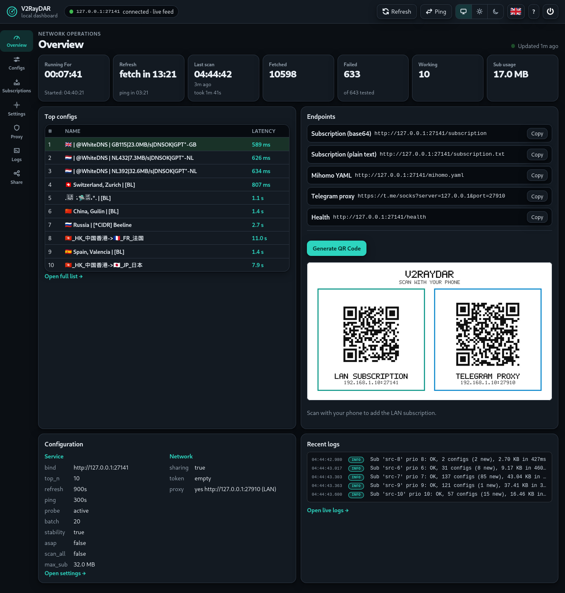
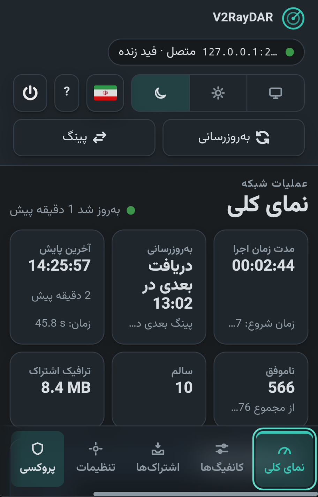
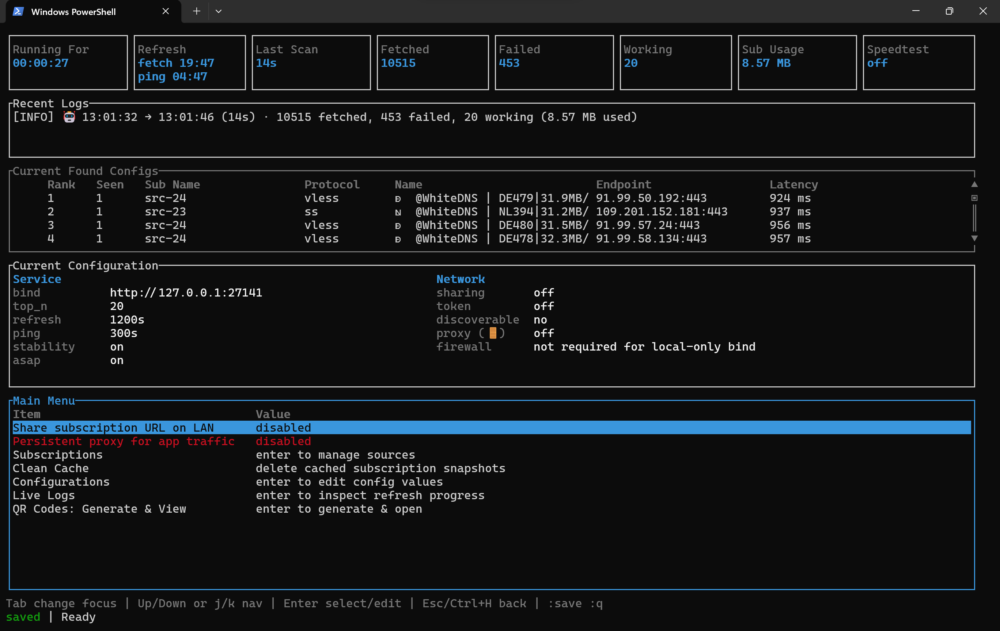

<p align="center">
  <a href="https://deepwiki.com/411A/V2RayDAR">
    
  </a>
</p>

<p align="center">
  <strong>🌐 Available in</strong><br>
  <strong><a href="../README.md">English</a></strong>
  • <strong><a href="README.fa.md">فارسی</a></strong>
  • <strong><a href="README.zh-CN.md">简体中文</a></strong>
  • <strong><a href="README.ru.md">Русский</a></strong>
  • <strong><a href="README.fr.md">Français</a></strong>
</p>

<p align="center">
  
</p>

<h1 align="center">V2RayDAR</h1>

<p align="center">
  <em>V2Ray 检测与侦察 — 发音类似 <code>v2ray</code> + <code>radar</code>。</em><br>
  <a href="https://github.com/411A/V2RayDAR/releases/latest"></a>
  <a href="../LICENSE"></a>
  <a href="https://github.com/411A/V2RayDAR/actions/workflows/rust.yml"></a>
</p>

<p align="center">
  <strong>只需在任何常开设备上运行一次——旧手机、电脑、树莓派或家庭服务器皆可——V2RayDAR 便会持续查找、验证最佳可用配置，并将其提供给局域网中的每台设备。它还提供标准的 SOCKS5/HTTP 代理，因此局域网中的每台设备都能使用可用的 V2Ray 连接——无需安装 V2Ray 客户端。</strong>
</p>

<p align="center">
  一款快速的 Rust 服务，内置 Web 仪表盘：获取 V2Ray / Clash / Mihomo 订阅源，通过 <code>sing-box</code> 在真实网络中验证配置，对可用配置进行排名，并在本地订阅 URL 上重新发布最佳配置，供 v2rayN / v2rayNG / sing-box / Clash Verge / Mihomo 客户端使用。可选的终端界面（<code>--tui</code>）仅提供少量额外的维护操作。
</p>

<p align="center">
  📘 <a href="guide.md">阅读详细指南</a>
  • 🧠 <a href="https://deepwiki.com/411A/V2RayDAR">Ask DeepWiki</a>
  • 📡 <a href="#-订阅端点">端点</a>
  • 🌐 <a href="#-持久代理">代理</a>
</p>

## 📖 目录

- [✨ 功能](#-功能)
- [🖥️ 界面](#-界面)
- [📦 安装](#-安装)
  - [ Linux / macOS](#-linux--macos)
  - [ Windows](#-windows-powershell)
  - [ Android / Termux](#-android--termux)
- [🚀 快速开始](#-快速开始)
- [⚙️ 配置](#-配置)
- [📡 客户端配置](#-客户端配置)
- [🌐 持久代理](#-持久代理)
- [🔒 受限网络](#-受限网络)
- [🤝 贡献](#-贡献)
- [⚠️ 免责与安全](#-免责与安全)
- [☕ 支持](#-支持)
- [📄 许可证](#-许可证)

## ✨ 功能

### 🔎 发现与验证

- **并行获取** — 并行获取任意数量的订阅源。
- **多格式解析** — 解析原始文本、base64、JSON 和 YAML 格式，支持 `vmess`、`vless`、`trojan`、`ss`、`ssr`、`hysteria2`、`hy2`、`tuic` 分享链接。
- **真实验证** — 通过 `sing-box` 在当前网络中验证每个候选配置（实际加载测试 URL 通过代理）。
- **智能排名** — 对真正可用的配置进行排名，最可靠的排在最前。

### 🔄 格式转换与输出

- **Clash/Mihomo 输入** — 添加 Mihomo 订阅 URL，V2RayDAR 自动提取所有代理条目。
- **双向格式转换** — 在 V2Ray 分享链接和 Clash/Mihomo YAML 代理条目之间互转。
- **双格式输出** — 以 V2Ray 分享链接（`/subscription`）**和**完整 Mihomo YAML 配置（`/mihomo.yaml`）提供可用配置，兼容任何客户端。
- **单一新鲜订阅** — 在本地 URL 重新发布最佳可用配置，兼容客户端只需指向一个始终最新的订阅源。

### 🌐 持久代理

- **常驻代理** — 保持 `sing-box` 进程持续运行，使用最佳配置对外提供本地混合 SOCKS5/HTTP 代理，任何应用均可使用，无需 V2Ray 客户端。
- **自动切换** — 当前配置失效时切换到下一个最佳配置，每个刷新周期切换到更优配置。

### 📱 局域网共享与二维码

- **局域网共享** — 可选的局域网共享及令牌保护，方便手机使用同一订阅源。
- **局域网代理** — 绑定 `0.0.0.0` 并添加防火墙规则，Telegram 一键配置：`https://t.me/socks?server=192.0.2.2&port=27910`。
- **二维码** — 为局域网订阅和 Telegram 代理生成可扫描的二维码：仪表盘 Share 标签页、每行配置的二维码按钮，或 TUI 主菜单的 `QR Codes: Generate & View`（桌面端，保存至 `v2raydar_data/QRCodes.jpg`）。

### 🔒 受限网络

- **已探测配置库** — 通过数据库中先前探测过的配置、网络内桥接配置或 `emergency_config` 在受限网络中存活，可用 `use_cache_only` 从库中加载。

## 🖥️ 界面

### 🌐 Web 仪表盘（默认）

Web 仪表盘是默认界面，在单个浏览器页面覆盖日常使用的完整流程：实时 Overview 统计、带逐行二维码的排名 Configs、Subscriptions 管理（添加、编辑、启用/禁用、删除、拖拽排序）、Settings 标签页中的全部设置、Proxy 标签页、局域网共享、实时 Logs，以及方便手机接入的二维码页面。

启动应用后，在浏览器中打开 http://127.0.0.1:27141。

<p align="center">
  
</p>

<p align="center">
  
</p>

### 🖥️ 可选 TUI（`--tui`）

使用 `v2raydar --tui` 可在仪表盘和端点之外同时启动经典终端界面。它额外提供缓存清理、恢复默认设置等操作——其余功能仪表盘中同样具备。

<p align="center">
  
</p>

## 📦 安装

运行对应平台的安装脚本。它按默认设置执行（回车接受），拒绝则进入逐步提示；就地更新会保留数据。

安装程序会：自动检测平台，下载附带 `sing-box` 的最新版本，验证 SHA-256 校验和，检测已安装版本并提供更新（保留 `data.db` 和 `v2raydar_data/`），默认无需 sudo。

####  Linux / macOS

```bash
curl -fsSL https://raw.githubusercontent.com/411A/V2RayDAR/main/install.sh | sh
```

####  Windows (PowerShell)

```powershell
irm https://raw.githubusercontent.com/411A/V2RayDAR/main/install.ps1 | iex
```

####  Android / Termux

```bash
pkg update -y && apt update && apt full-upgrade -y && pkg install -y curl tar && curl -fsSL https://raw.githubusercontent.com/411A/V2RayDAR/main/install.sh | bash && cd ~/V2RayDAR && ./v2raydar
```

### 👤 用户安装

二进制文件到 `~/.local/bin`，数据在主目录：
```bash
# Linux / macOS
curl -fsSL https://raw.githubusercontent.com/411A/V2RayDAR/main/install.sh | sh -s -- --user

# Windows
irm https://raw.githubusercontent.com/411A/V2RayDAR/main/install.ps1 | iex
# 然后在提示时选择选项 2
```

* **停止：** `Ctrl + C`
* **启动：** `cd ~/V2RayDAR && ./v2raydar`

### 📥 手动下载

从 [Releases](https://github.com/411A/V2RayDAR/releases/latest) 下载对应操作系统的压缩包后直接运行。

**便携模式**（推荐）— 所有文件都在同一目录。自包含目录（可执行文件旁附带的 `sing-box` 或已有的 `v2raydar_data/`）会被自动检测，双击即可运行——任何位置都可用 `--portable` 强制启用。便携模式安装到 `Desktop/V2RayDAR`（若存在桌面目录），否则安装到 `~/V2RayDAR`。

## 🚀 快速开始

使用上述脚本安装后，运行 `v2raydar`（Windows 上为 `v2raydar.exe`）。首次启动会在 `data.db` 中初始化默认设置和预选订阅源。老版本升级时，现有的 `configs.yaml` 会自动迁移进 `data.db`。

1. **等待数据填充。** 应用并行获取订阅源，通过真实网络探测每个配置，并对可用配置进行排名。端点从启动即可用 — 客户端可以立即指向它。
2. **将客户端指向**下方任一[订阅端点](#-订阅端点)。
3. **使用仪表盘** `http://127.0.0.1:27141` — Overview、Configs、Subscriptions、Settings、Proxy、Logs 和 Share 共 7 个标签页。所有修改即时保存到数据库并同步到实时运行状态；影响刷新的设置将在下一个周期生效（保存时仪表盘会有说明），订阅源列表的变更则会立即重新获取。
4. **更改设置** — 在仪表盘 Settings 标签页（或带 `--tui` 的 TUI Configurations 界面）中修改，修改即时保存，影响刷新的设置在下一个计划周期或手动刷新时生效。关键设置：`top_n`、`refresh_seconds`、`ping_seconds`、`sharing.enabled`、`probe.mode`。新版本新增的设置项会自动使用默认值，你已有的值不会被改动。
5. **退出** — 按 `Ctrl + C`。退出后端点停止服务。

### 📡 订阅端点

三种输出格式，对应三类客户端：

| 客户端 | 端点 |
| --- | --- |
| v2rayN / v2rayNG | `http://127.0.0.1:27141/subscription`（base64） |
| sing-box | `http://127.0.0.1:27141/subscription.txt`（纯文本） |
| Clash Verge / Mihomo | `http://127.0.0.1:27141/mihomo.yaml` |

### ⚙️ 运行模式

```bash
v2raydar                # 静默模式 — 仅浏览器提示，无日志
v2raydar --no-tui       # 无头模式 — 详细信息和日志，无 TUI
v2raydar --tui          # TUI + 本地订阅端点
v2raydar --once         # 刷新一次，打印结果后退出
v2raydar --portable     # 所有数据保存在可执行文件旁边（便携目录自动检测）
v2raydar --uninstall    # 删除应用数据和已创建的防火墙规则
```

Windows 用户将 `v2raydar` 替换为 `v2raydar.exe`。macOS 上首次打开捆绑的 `.app` 后，Gatekeeper 会记住它。

<details>
  <summary>🖥️ <strong>TUI 快捷键</strong></summary>

| 按键 | 操作 |
| --- | --- |
| `↑` / `↓` 或 `j` / `k` | 导航 |
| `Enter` | 选择 / 切换 / 确认 |
| `Esc` / `Ctrl+H` | 返回 |
| `Space` | 切换订阅开关 |
| `e` | 编辑选中的订阅 |
| `Ctrl+R` | 手动刷新（重新获取一次，刷新运行时不可用） |
| `Ctrl+P` | 手动重测已缓存的配置（有任务运行时不可用） |
| `q` | 退出 |
| `:` | 命令模式 — `:q` 退出，`:w` 保存，`:a` 添加，`:d` 删除，`:n` 重命名，`:u` 修改 URL，`:p` 修改优先级，`:r` 刷新，`:ping` 重测 |

</details>

## ⚙️ 配置

<details>
  <summary>👣 <strong>查看全部设置与默认值</strong></summary>

| 键 | 默认值 | 用途 |
| --- | --- | --- |
| `bind` | `127.0.0.1:27141` | 本地 HTTP 绑定地址，用于 `/subscription`、`/subscription.txt`、`/results` 和 `/health`。 |
| `top_n` | `10` | 发布给客户端的可用配置数量。 |
| `refresh_seconds` | `900` | 自动刷新间隔（秒）；`0` 禁用定时刷新。 |
| `ping_seconds` | `300` | 已缓存配置的重测间隔（秒），不重新获取订阅；`0` 禁用。当缓存验证通过的数量少于 `top_n` 时，ping 还会检测数据库中此前见过的配置以补足。两者均计入 Sub Usage。 |
| `encoded_subscription` | `true` | `/subscription` 返回 base64 编码（兼容 v2rayN / v2rayNG）。 |
| `prioritize_stability` | `true` | 优先重新探测上一轮保存的 Top-N，即使新发现的配置延迟更低也保持其靠前。设为 `false` 则优先选择低延迟的可用配置。 |
| `return_configs_asap` | `false` | 设为 `true` 时，找到可用配置后立即发布到端点，最多 `top_n` 个；早期配置可能不是延迟最低或最稳定的。 |
| `scan_all_configs` | `false` | 设为 `true` 时验证所有加载的配置，而非找到足够可用配置后停止。 |
| `fetch_timeout_ms` | `30000` | 每个源的获取超时。 |
| `fetch_concurrency` | `8` | 并行获取的订阅源数量。 |
| `max_subscription_bytes` | `33554432` | 每个订阅源的大小上限（32 MiB）。 |
| `use_cache_only` | `false` | 跳过实时获取，从数据库加载先前探测过的配置 — 适用于高度受限网络。 |
| `emergency_config` | `null` | 可选的可用分享链接，用于通过 `sing-box` 作为桥接代理在 HTTP 订阅获取失败时使用。 |
| `clean_offlines_after_days` | `7` | 不可达配置从数据库中删除的天数。 |
| `sharing.enabled` | `false` | 允许局域网客户端访问端点。 |
| `sharing.require_token` | `false` | 局域网请求需要 `?token=...`。 |
| `sharing.token` | `null` | 留空则禁用，设为 `true` 自动生成，或提供字符串。 |
| `proxy.enabled` | `false` | 启动持久的 `sing-box` 进程，对外提供混合 SOCKS5/HTTP 代理。 |
| `proxy.port` | `27910` | 混合 SOCKS5/HTTP 代理端口。 |
| `proxy.discoverable` | `false` | 绑定到 `0.0.0.0` 并添加防火墙规则以允许局域网访问。 |
| `proxy.rotating_proxy` | `true` | `true` 表示每个周期将代理切换到延迟最低的配置；`false` 表示当前配置可用时保持不变。 |
| `proxy.health_check_url` | `https://cp.cloudflare.com` | 通过代理测试的健康检查 URL。 |
| `proxy.health_check_interval_seconds` | `60` | 代理健康检查间隔（秒）。故障时自动切换。 |
| `probe.mode` | `active` | `active` 使用 `sing-box`；`tcp` 仅用于诊断。 |
| `probe.sing_box_path` | `null` | 可选的 `sing-box` 路径。桌面 `_with_singbox` 构建或内置 `sing-box` 的 Termux 构建可设为 `null`。 |
| `probe.connect_timeout_ms` | `5000` | 诊断探测的 TCP 连接超时。 |
| `probe.active_timeout_ms` | `30000` | 活跃模式下的 HTTP 测试超时。 |
| `probe.startup_timeout_ms` | `5000` | 等待临时代理启动的时间。 |
| `probe.concurrency` | `16` | 基础活跃探测并发数。 |
| `probe.batch_size` | `20` | 初始活跃探测批次大小。 |
| `probe.process_concurrency` | `null` | 允许同时运行的 `sing-box` 批处理进程数；为空时自动缩放。 |
| `probe.test_url` | `https://www.gstatic.com/generate_204` | 通过每个候选配置加载的测试 URL。 |
| `probe.accepted_statuses` | `[204, 200]` | 视为成功的 HTTP 状态码。 |
| `probe.download_url` | `null` | 可选的吞吐量测试目标。 |
| `probe.download_bytes_limit` | `1048576` | 每次速度测试的读取上限。 |
| `geoip_db_path` | `null` | 可选的 `GeoLite2-Country.mmdb` 文件或国家 IP 区目录（`zones.txt`，或旧式 `<cc>.zone` 文件）路径。为 `null` 时使用 `<data-root>/geoip`（优先 MaxMind 数据库，zone 兜底；两者均由安装程序更新）。Country data: GeoLite2 by MaxMind (CC BY-SA 4.0); fallback zones by ipdeny. |
| `subscriptions` | _（预选源）_ | `{ name, url, enabled, priority }` 源列表。建议添加自己的源以获得更好的覆盖。 |

</details>

### 🗄️ 查看数据库

可以下载这个免费软件查看或修改（不推荐）数据库文件（`data.db`）：https://sqlitebrowser.org/dl

注意，直接修改数据库可能会导致系统出现问题。

行为细节、示例、迁移说明与高级配置请参阅[开发者指南](guide.md)。

## 📡 客户端配置

### v2rayN（同一台电脑）

保持 `bind: 127.0.0.1:27141`，添加 `http://127.0.0.1:27141/subscription` 作为订阅 URL。

### v2rayNG / 同一 Wi-Fi 的手机

绑定到电脑的局域网 IP（如 `192.0.2.23:27141`），开启 `sharing.enabled`，然后在手机上使用 `http://192.0.2.23:27141/subscription`。先从手机访问 `/health` 确认可达性。

### sing-box（纯文本格式）

```text
http://127.0.0.1:27141/subscription.txt
```

### Clash Verge / Mihomo（YAML 配置格式）

```text
http://127.0.0.1:27141/mihomo.yaml
```

直接在 Clash 客户端的配置/订阅设置中导入该 URL。V2RayDAR 会生成包含代理条目、`url-test` 代理组和兜底 `MATCH` 规则的完整 Mihomo 配置。

完整的客户端配置指南、令牌保护共享和操作系统特定防火墙详情请参阅[开发者指南](guide.md)。

## 🌐 持久代理

V2RayDAR 可以在订阅端点旁边运行一个持久的 SOCKS5/HTTP 代理。系统上的任何应用 — Telegram、浏览器、curl、Python — 都可以通过它路由流量，无需单独的 VPN 客户端。

**在仪表盘 Proxy 标签页或 TUI Proxy 行中启用**
（`enabled: true`，端口 `27910`，`discoverable: true` = 局域网访问 + 防火墙规则）。

### 本地使用（在运行 V2RayDAR 的设备上）

```bash
# SOCKS5
curl --socks5 127.0.0.1:27910 https://api.ipify.org

# HTTP
curl --proxy http://127.0.0.1:27910 https://api.ipify.org
```

### 局域网使用（同一 Wi-Fi 的手机）

1. 设置 `proxy.discoverable: true` — V2RayDAR 会添加防火墙规则并绑定到 `0.0.0.0`。
2. 在仪表盘 Overview 标签页 **Network** 下找到电脑的局域网 IP（或 TUI 的 **Current Configuration** 面板，或运行 `ipconfig` / `ip addr`）。例如 `192.0.2.2`。

### Telegram

将 `YOUR_LAN_IP` 替换为你的实际局域网 IP，在手机上打开此 URL：

```text
https://t.me/socks?server=YOUR_LAN_IP&port=27910
```

例如，如果你的局域网 IP 是 `192.0.2.2`：

```text
https://t.me/socks?server=192.0.2.2&port=27910
```

或手动：Telegram → 设置 → 数据和存储 → 代理设置 → 添加代理：
- 类型：**SOCKS5** 或 **HTTP**
- 主机：`YOUR_LAN_IP`（仪表盘或 TUI 面板中显示的 IP）
- 端口：`27910`

### Android 全局代理

设置 → WiFi → 长按网络 → 修改 → 高级 → 代理 → 手动 → 服务器：`YOUR_LAN_IP`，端口：`27910`。

## 🔒 受限网络

三种兜底机制，按顺序：

1. **先前探测过的配置** — 存储在数据库中，可通过 `use_cache_only: true` 使用。
2. **网络内桥接** — 如果某些 HTTP 订阅 URL 无法连接但有可用配置，应用会使用该配置重试失败的订阅。默认自动进行；如果没有可用配置但你有一个可用配置，可以将其设为 `emergency_config`（在仪表盘设置页或 TUI 配置界面中）。
3. **紧急配置** — 你自己的已知可用分享链接，作为显式兜底。

完整重试顺序与示例请参阅详细指南中的 Restricted-Network Behavior 一节。

## 🤝 贡献

欢迎贡献！可以提交 Issue 报告错误、提出功能请求、问题或建议，也可以提交 Pull Request。任何反馈都非常感谢。

🤖 V2RayDAR 由人类维护者在多个人工智能助手的协助下设计与开发——无论贡献来自人类还是其 AI 助手，只要经过人工审核，都同样欢迎。

## ⚠️ 免责与安全

### 免责声明

本应用按“现状”发布，不提供任何保证。

### 第三方配置

V2RayDAR 本身不会创建或分发 V2Ray 兼容配置。它只扫描你配置的订阅源，并在本机重新发布找到的可用配置。你应对自己扫描、导入和连接的订阅 URL 与配置负责。

### 安全警告

你连接的 V2Ray 服务器所有者可能能够截获你的流量并读取未加密数据。同机使用请用 `127.0.0.1:27141`，在共享或不可信局域网请开启 `sharing.require_token: true`，切勿将 V2RayDAR 的 HTTP 端点暴露到公网。请将订阅 URL 与分享链接视为敏感信息。

## ☕ 支持

### 💬 联系方式

<p align="center">
<a href="https://t.me/TechKrakenBot">
  
</a>
</p>

### 💎 TON 捐赠

如果你觉得本项目有帮助，可以通过 TON 区块链捐赠支持开发：

```text
ton://transfer/TechKraken.ton
```

```text
UQCGk4IU5nm6dYWjXTx6vSQVOtKO4LQg3m8cRcq1eQo7vhCl
```

## 📄 许可证

V2RayDAR 基于 **GNU Affero General Public License v3.0 (AGPL-3.0)** 授权 — 详见 [LICENSE](../LICENSE)。
